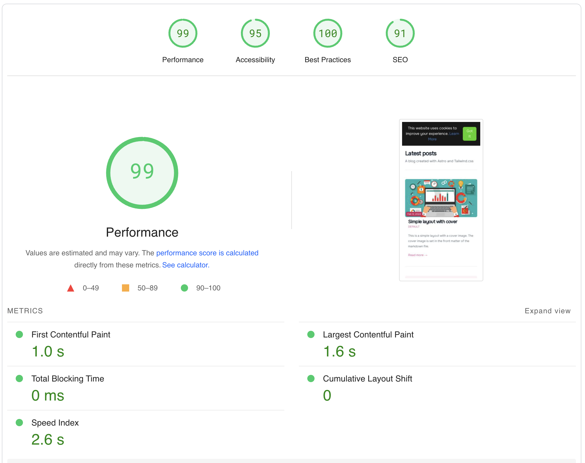

# Tailwind Astro Starter Project

[](https://GitHub.com/wanoo21/tailwind-astro-starting-blog/stargazers/)
[](https://GitHub.com/wanoo21/tailwind-astro-starting-blog/network/)
[](https://twitter.com/ipwanciu)
[](https://github.com/sponsors/wanoo21)

[](https://vercel.com/new/git/external?repository-url=https://github.com/wanoo21/tailwind-astro-starting-blog)

This template is perfect for those who want to use Tailwind CSS and Astro to build a blog.

It is inspired by the [Tailwind Next.js Starter Blog](https://github.com/timlrx/tailwind-nextjs-starter-blog) - one of the most popular Next.js blogging templates.

Feature request or Facing issue? Check the [discussion page](https://github.com/wanoo21/tailwind-astro-starting-blog/discussions) to see if it has been brought up previously. Otherwise, feel free to start a new discussion thread. All ideas are welcomed!

## Demo

[Live Demo](https://tasb.yon.fun/) - Deployed on Vercel.

## Features

- Astro v5 with TypeScript
- Astro MDX support
- [Solid-js](https://solidjs.com) for some interactivity
- Easy styling customization with [Tailwind CSS v4](https://tailwindcss.com/docs/upgrade-guide) (via the official `@tailwindcss/vite` plugin) and primary color attribute
- Mobile-friendly view
- Light and dark theme
- Font optimization via [@fontsource](https://fontsource.org/)
- Automatic image optimization via Astro image component
- Support for tags - each unique tag will be its own page
- Support for multiple authors
- 2 different blog post layouts, including a full-width cover image
- 2 different blog listing layouts
- Support for nested routing of blog posts
- Support for [Giscus](https://giscus.app/) comments (powered by GitHub Discussions)
- Projects page
- i18n support
- **Fully SEO optimized**, including Open Graph and Twitter Cards
- Almost Perfect lighthouse score (for mobile - 99/95/100/91) - [Lighthouse Report](https://pagespeed.web.dev/analysis/https-tasb-yon-fun/gp1vypobei?form_factor=mobile)



Even thought these features looks the same as the original template, they are implemented in a different way, and there are more to come.

However, there are some features that are not in the original template, like:

- Support for multiple authors pages - **each author will have** its own page, with a list of all the posts written by him/her.
- Support for multiple tags pages - **each tag has its own page with custom description**, that can be customized with markdown.
- Related posts - **each post has** a list of related posts, provided by the author inside the markdown file.
- Pagination inside blog/tags pages - **each blog/tags page has** a pagination.
- Cool animations provided by Astro.
- And many more that would come in the future.

## Internationalization

This template has support for i18n, it's set up for English as default. You can add more languages in the `src/i18n/ui.ts` file. It doesn't have support for dynamic language change, but it's easy to implement.

## Extend / Customize

`src/consts.ts` contains a list of constants that you can customize to your liking, including the blog title, description, author, social media links, etc.

`src/functions.ts` contains a list of functions that changes the default behavior of the template, including default post sorting and exclude draft posts.

`src/content/authors/default.mdx` contains the default author information. You can add more authors by adding more `.mdx` files in the `src/content/authors` folder.

`src/content/tags/default.mdx` contains the default tag information. You can add more tags by adding more `.mdx` files in the `src/content/tags` folder.

`src/content/config.ts` contains all fields for author, blog and tags pages. Check what's required and what's not. You can also add more fields if you want to.

## Comments

This template now supports [Giscus](https://giscus.app/) comments, which uses GitHub Discussions as a backend. To enable comments on your blog:

1. **Enable GitHub Discussions** on your repository:
   - Go to your repository settings
   - Scroll down to the "Features" section
   - Enable "Discussions"

2. **Install the Giscus app**:
   - Visit [giscus.app](https://giscus.app/)
   - Follow the configuration steps to get your repository details

3. **Configure Giscus in your blog**:
   - Open `src/consts.ts`
   - Find the `comments` section in `SITE_METADATA`
   - Fill in your Giscus configuration:
     ```typescript
     comments: {
       provider: 'giscus', // Set to 'giscus' to enable comments or null to disable
       giscusConfig: {
         repo: 'username/repo', // Your GitHub repository
         repositoryId: 'R_xxxxx', // Your repository ID from giscus.app
         category: 'General', // Discussion category
         categoryId: 'DIC_xxxxx', // Category ID from giscus.app
         mapping: 'pathname', // How to map pages to discussions
         reactionsEnabled: '1', // Enable reactions: '1' or '0'
         emitMetadata: '0', // Emit discussion metadata: '1' or '0'
         inputPosition: 'top', // Comment box position: 'top' or 'bottom'
         theme: 'light', // Theme for light mode
         darkTheme: 'dark', // Theme for dark mode
         lang: 'en', // Language code
         loading: 'lazy', // Loading mode: 'lazy' or 'eager'
       },
     }
     ```

4. **Control comment visibility** (optional):
   - In `src/consts.ts`, under `POST_METADATA`, you can disable comments globally:
     ```typescript
     showComments: false, // Set to false to hide comments on all posts
     ```

The comments section will automatically adapt to your site's theme (light/dark mode).

## 🧞 Commands

All commands are run from the root of the project, from a terminal:

| Command                   | Action                                           |
| :------------------------ | :----------------------------------------------- |
| `npm install`             | Installs dependencies                            |
| `npm run dev`             | Starts local dev server at `localhost:4321`      |
| `npm run build`           | Build your production site to `./dist/`          |
| `npm run preview`         | Preview your build locally, before deploying     |
| `npm run astro ...`       | Run CLI commands like `astro add`, `astro check` |
| `npm run astro -- --help` | Get help using the Astro CLI                     |

### 🐳 Docker Commands

All Docker commands are run from the root of the project, from a terminal:

| Command                           | Action                                                   |
| :-------------------------------- | :------------------------------------------------------- |
| `docker build -t app:1.0.0 .`     | Build the Docker image for the Astro application.        |
| `docker run -p 80:4321 app:1.0.0` | Run a Docker container with the built Astro application. |
| `docker pull edwardb11/app:2.0.0` | Download the Docker image from Docker Hub.               |
