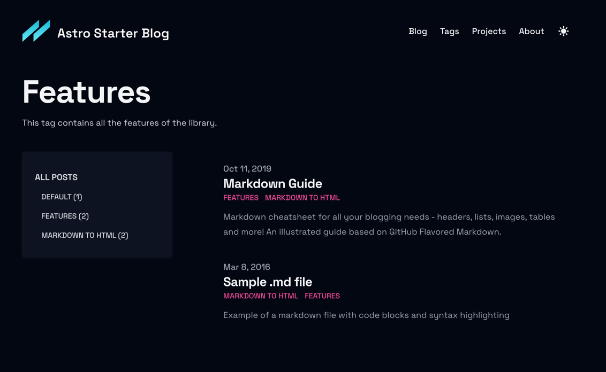

# Tailwind Astro Starter Project

[//]: # ([![Sponsor]&#40;https://img.shields.io/static/v1?label=Sponsor&message=%E2%9D%A4&logo=GitHub&link=https://github.com/sponsors/timlrx&#41;]&#40;https://github.com/sponsors/timlrx&#41;)

    

This template is perfect for those who want to use Tailwind CSS and Astro to build a blog. 

It is inspired by the [Tailwind Next.js Starter Blog](https://github.com/timlrx/tailwind-nextjs-starter-blog) - one of the most popular Next.js blogging templates.

Feature request or Facing issue? Check the [discussion page](https://github.com/wanoo21/tailwind-astro-starting-blog/discussions) to see if it has been brought up previously. Otherwise, feel free to start a new discussion thread. All ideas are welcomed!

## Demo

[Live Demo](https://tasb.yon.fun/) - Deployed on Vercel.

## Features

- Astro with Typescript
- Astro MDX support
- Easy styling customization with [Tailwind 3.3](https://tailwindcss.com/blog/tailwindcss-v3-3) and primary color attribute
- ~~Perfect lighthouse score~~ - Still have to make some improvements
- Mobile-friendly view
- Light and dark theme
- ~~Font optimization~~ - Not yet implemented
- Automatic image optimization via Astro image component
- Support for tags - each unique tag will be its own page
- Support for multiple authors
- ~~3 different blog layouts~~ - Only 2 for now
- ~~2 different blog listing layouts~~ - Only 1 for now
- Support for nested routing of blog posts
- Projects page
- ~~SEO friendly~~ still working on this, but already supports RSS feed, sitemaps and more!

Even thought these features looks the same as the original template, they are implemented in a different way, and there are more to come.

However, there are some features that are not in the original template, like:

- Support for multiple authors pages - **each author will have** its own page, with a list of all the posts written by him/her.
- Support for multiple tags pages - **each tag has its own page with custom description**, that can be customized with markdown. 
- Related posts - **each post has** a list of related posts, provided by the author inside the markdown file.
- Pagination inside blog/tags pages - **each blog/tags page has** a pagination.
- Cool animations provided by Astro.
- And many more that would come in the future.

## Extend / Customize

`src/consts.ts` contains a list of constants that you can customize to your liking, including the blog title, description, author, social media links, etc.

`src/functions.ts` contains a list of functions that changes the default behavior of the template, including default post sorting and exclude draft posts.

`src/content/authors/default.mdx` contains the default author information. You can add more authors by adding more `.mdx` files in the `src/content/authors` folder.

`src/content/tags/default.mdx` contains the default tag information. You can add more tags by adding more `.mdx` files in the `src/content/tags` folder.

`src/content/config.ts` contains all fields for author, blog and tags pages. Check what's required and what's not. You can also add more fields if you want to.

## 🧞 Commands

All commands are run from the root of the project, from a terminal:

| Command                   | Action                                           |
| :------------------------ | :----------------------------------------------- |
| `npm install`             | Installs dependencies                            |
| `npm run dev`             | Starts local dev server at `localhost:4321`      |
| `npm run build`           | Build your production site to `./dist/`          |
| `npm run preview`         | Preview your build locally, before deploying     |
| `npm run astro ...`       | Run CLI commands like `astro add`, `astro check` |
| `npm run astro -- --help` | Get help using the Astro CLI                     |

### 🐳 Docker Commands

All Docker commands are run from the root of the project, from a terminal:

| Command                               | Action                                                   |
| :------------------------------------ | :------------------------------------------------------- |
| `docker build -t app:1.0.0 .`         | Build the Docker image for the Astro application.        |
| `docker run -p 80:4321 app:1.0.0`     | Run a Docker container with the built Astro application. |
| `docker pull edwardb11/app:2.0.0`     | Download the Docker image from Docker Hub.               |
